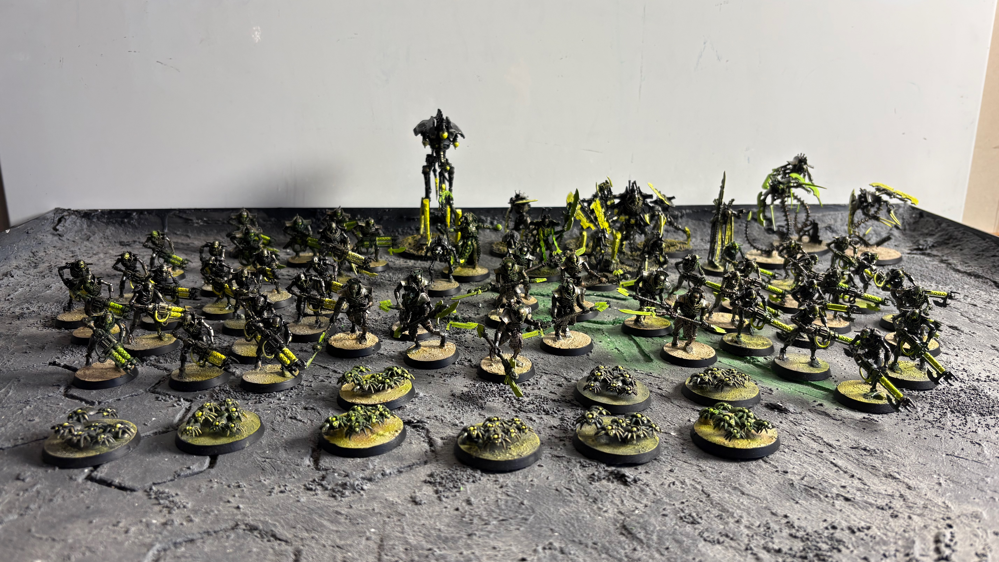


A growing Necron army focused on weathered metallics and desert basing.


## Overview

A very, very cool Necron Army.

## Progress
Document steps, build stages, and painting progress.

## Paint Recipes / Techniques
- [Basing](base/)
- [Color schemes](paint/)
- Notes for future reference

## Army Building
- [Roster](roster/) — owned, assembled, and wishlist models
- [40k Army List](army-40k/) — list sketches by points bracket
- [Escalation League](escalation-league/) — Mythos league schedule and per-round lists

## Photos


