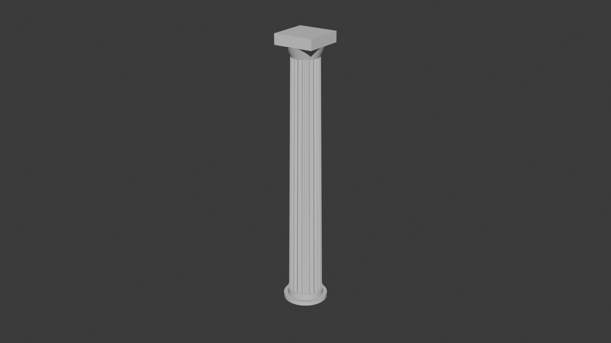

## Concept

Fluted marble columns for the ruined-temple filler terrain — a batch of whole standing columns plus toppled ones broken into segments, sitting alongside the walls and arches of the [ruins](../ruins).

## Features

- Tapered fluted shaft, low round plinth, square abacus capital on a round echinus flare (matches the blocky square cap on the fallen column in the Prospero ruins reference art)
- Whole/standing variant for columns still upright among the ruins
- A kit of standing broken parts — base (plinth + stub), middle (generic drum), top (stub + capital) — rather than a fixed pre-arranged pile, so they can be mixed, stacked, or scattered by hand when building the board
- All fracture surfaces are irregular/jagged (broken stone), not clean plane cuts

## Best materials

- **3D printer / resin** — all variants, single-piece print per part

## Build idea

Print several of the whole column for standing ruin sections. Print a batch of base/middle/top parts and combine or scatter them freely — stack base+middle+top with gaps for a "recently toppled" look, or spread individual parts as rubble among other ruins pieces. No assembly beyond placement: each STL prints and sits as one piece.

## Generator script

[`columns.py`](columns.py) — Blender (`bpy`) pipeline, config-driven, exports one STL per part (whole / base / middle / top).
