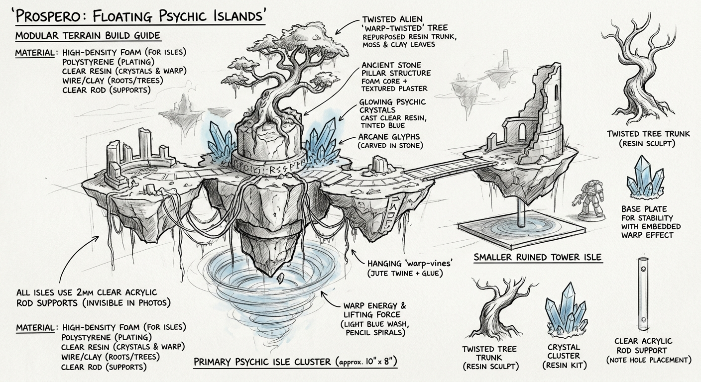

## Concept

Floating islands held aloft by psychic energy.

## Features

- Stone pillars floating vertically
- Twisted alien trees
- Crystal clusters
- Hanging roots/vines
- Energy glow underneath

## Best materials

- **Foam** — rocks and cliffs
- **Real branches** — trees
- **3D printer** — crystal clusters, supports, alien plants
- **Clear acrylic rods** — floating effect
- **Magnets** — optional removable pieces

## Build idea

Make 3–5 smaller pieces: one large floating island, two medium pillars, several small scatter crystals. Gives gameplay cover.
