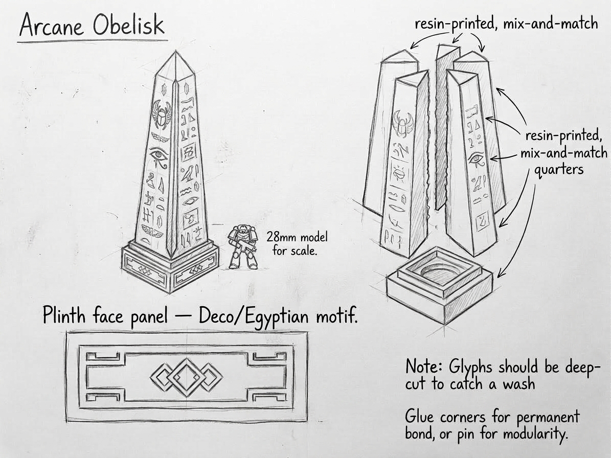

## Concept

Objective markers — the easiest pieces to build with the biggest visual impact.

## Features

- Tall narrow stone pillars
- Runes
- Crystal tops
- Broken pieces around the base

## Best materials

- **Foam** — main body
- **Laser cutter** — rune panels, geometric patterns
- **3D printer** — tops, symbols, decorations

## Build idea

Make 3–5 identical but slightly different ones.

Gameplay roles: objectives, psychic ritual points, teleport beacons.

## Generator script

[`obelisk.py`](obelisk.py) is the pipeline used to generate the obelisk body variants (multiple seeds/quadrants) and the plinth as separate STLs.
