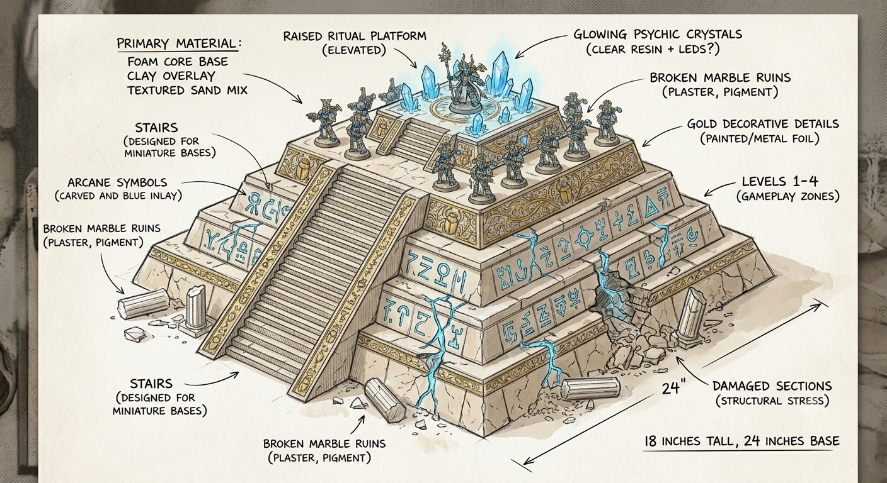

## Concept

The main centerpiece of the Prospero board — a large stepped pyramid/temple that dominates the battlefield. Not a perfect Egyptian pyramid — more like a Thousand Sons psyker academy / ritual site.

## Features

- Wide stone steps
- Raised platform at the top
- Broken sections
- Arcane symbols
- Crystal energy nodes
- Gold/blue details

## Best materials

- **Foam** — main structure, steps, rocks
- **Laser cutter** — MDF decorative panels, repeating wall patterns, stairs
- **3D printer** — runes, statues, crystal holders, scarab-like details

## Build idea

Build in layers: MDF base plate → XPS foam blocks → foam-cut stairs → laser-cut "stone panels" as decoration → printed rune pieces on top.

## Trim generator scripts

A set of Blender (`bpy`) scripts generates the decorative trim strips used along the pyramid's edges and corners — flat edge trim, corner pieces, and several border motifs (studs, fishbone spine, 2-strand and 3-strand braid) so tiers can be dressed consistently:

- [`trim_v1_plain.py`](trim_v1_plain.py) / [`trim_edge_v1_plain.py`](trim_edge_v1_plain.py) / [`trim_corner_v1_plain.py`](trim_corner_v1_plain.py)
- [`trim_v2_studs.py`](trim_v2_studs.py) / [`trim_edge_v2_studs.py`](trim_edge_v2_studs.py)
- [`trim_v3_fishbone_spine.py`](trim_v3_fishbone_spine.py) / [`trim_edge_v3_fishbone_spine.py`](trim_edge_v3_fishbone_spine.py)
- [`trim_v4_braid_2strand.py`](trim_v4_braid_2strand.py) / [`trim_edge_v4_braid_2strand.py`](trim_edge_v4_braid_2strand.py) / [`trim_corner_v4_braid_2strand.py`](trim_corner_v4_braid_2strand.py)
- [`trim_v5_braid_3strand.py`](trim_v5_braid_3strand.py) / [`trim_edge_v5_braid_3strand.py`](trim_edge_v5_braid_3strand.py)

Run headless via `blender --background --python trim_vN_*.py`, or open in Blender's Scripting workspace and run with Alt+P.
