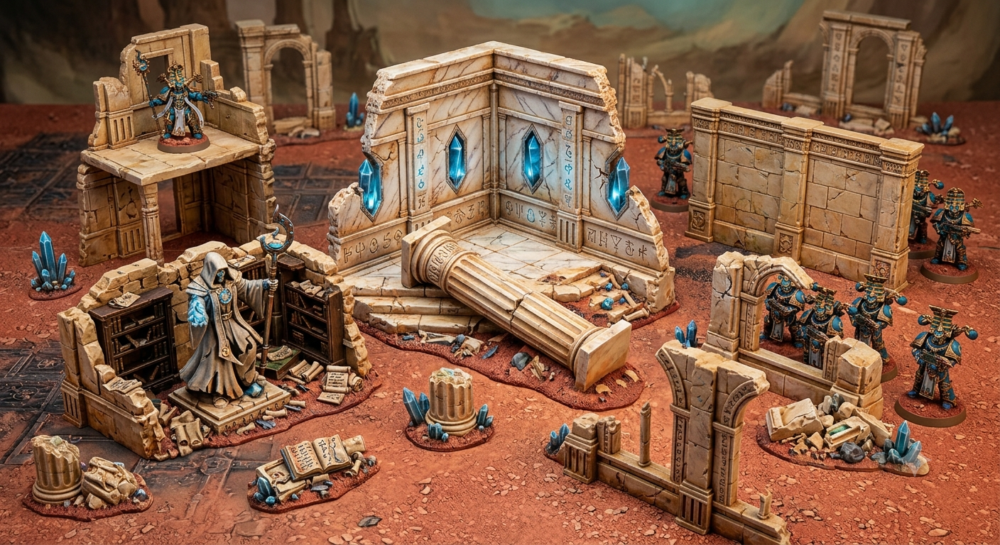

## Concept

The "filler" terrain that makes the board feel alive.

## Features

- Fallen columns
- Broken walls
- Statues
- Books/libraries
- Arcane machinery

## Best materials

- **Foam** — walls, rubble
- **Cork bark** — rocks
- **3D printer** — statues, skulls, books, symbols
- **Laser cutter** — wall patterns

## Build idea

Create several L-shaped ruins — great for cover, easy to move, good for gameplay.

See also [Prospero Columns](../columns) for the standing/broken columns that dress these ruins.
