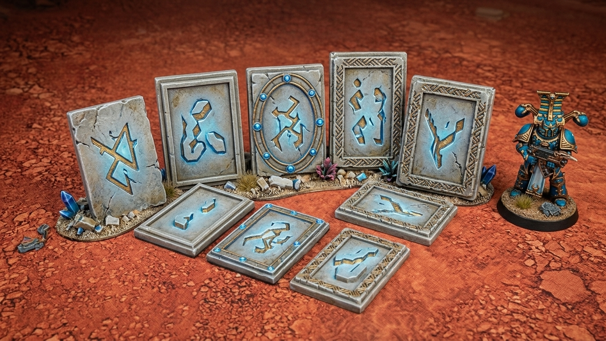

## Concept

Small engraved rune plaques for cladding Thousand Sons / Prospero-themed terrain (pyramids, obelisks, ruins) — or just as standalone scatter detail. Sixteen unique glyphs plus a blank frame panel, in six border styles, all sized and oriented for flat, support-free resin printing.



## What you get

- **16 unique rune glyphs** (`manifestation`, `decay`, `binding`, `chaos`, `cycle`, `void`, `dominion`, `earth`, `entropy`, `fire`, `flow`, `will`, `life`, `growth`, `transcendence`, `sacred`), each embossed on its own panel, plus **1 blank panel** (frame only, no rune) — 17 STLs per border style.
- **6 border styles** — same glyph, same panel, different frame:

| Style | Look |
|---|---|
| `v1_plain` | no frame — bare glyph |
| `v2_ring_gems` | thin rule-line ring, studded with diamond gems |
| `v3_fishbone_spine` | rule-line spine with periodic crossed ribs |
| `v4_fishbone_rows` | dense woven fishbone texture, no frame line |
| `v5_fishbone_2strand` | rail + zigzag ribbon (2-strand) |
| `v6_fishbone_3strand` | rail + zigzag ribbon (3-strand, denser) |

Pick whichever frame matches the rest of the board — or mix and match.

## Panel spec

- **18 × 27 × 2mm** base panel, glyph emboss standing ~1.5mm proud of the face (frame details are lower relief, ~0.6–0.8mm).
- All 12 edges are chamfered — softens the print, and gives a scraper something to catch when popping panels off the build plate.
- Each panel is oriented flat, glyph face up, plain back down — no supports needed, prints straight to the build plate.

## Printing

Designed and tested on an **Anycubic Photon Mono 2** (143 × 89mm plate). At 18×27mm per panel, expect roughly a dozen panels per plate with comfortable spacing — tighter auto-arrangement in a slicer can likely do better. No supports required; orient with the flat back against the plate as exported.

## Generator scripts

Each `rune_panel_v*.py` is a self-contained Blender script (tested on Blender 5.x) that generates the full 17-panel set for its border style — open in Blender's Scripting workspace and run (Alt+P), or headless via `blender --background --python rune_panel_vN_*.py`:

- [`rune_panel_v1_plain.py`](rune_panel_v1_plain.py)
- [`rune_panel_v2_ring_gems.py`](rune_panel_v2_ring_gems.py)
- [`rune_panel_v3_fishbone_spine.py`](rune_panel_v3_fishbone_spine.py)
- [`rune_panel_v4_fishbone_rows.py`](rune_panel_v4_fishbone_rows.py)
- [`rune_panel_v5_fishbone_2strand.py`](rune_panel_v5_fishbone_2strand.py)
- [`rune_panel_v6_fishbone_3strand.py`](rune_panel_v6_fishbone_3strand.py)
- [`build_stamp_library.py`](build_stamp_library.py) — builds the reusable glyph stamp library the panel scripts draw from

[`check_panel_volumes.py`](check_panel_volumes.py) is a sanity check to run after regenerating a batch — flags any panel whose volume looks off from the rest (a sign a boolean operation silently dropped or duplicated geometry, rather than a real error, so worth checking before printing):

```
python3 check_panel_volumes.py output/v6_fishbone_3strand
```
