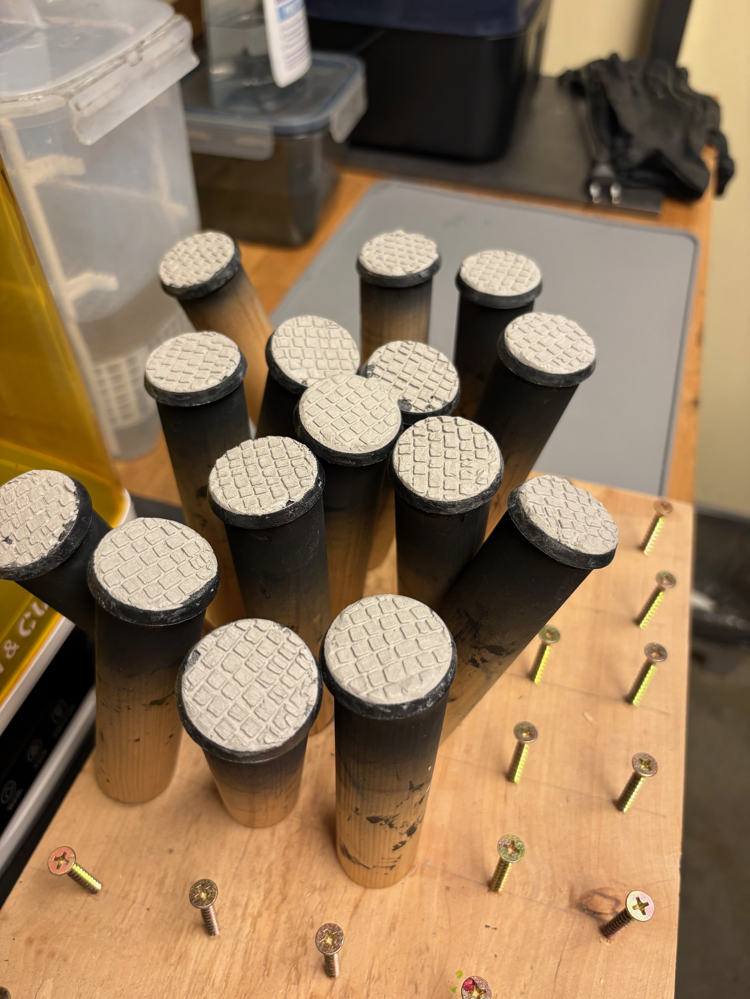
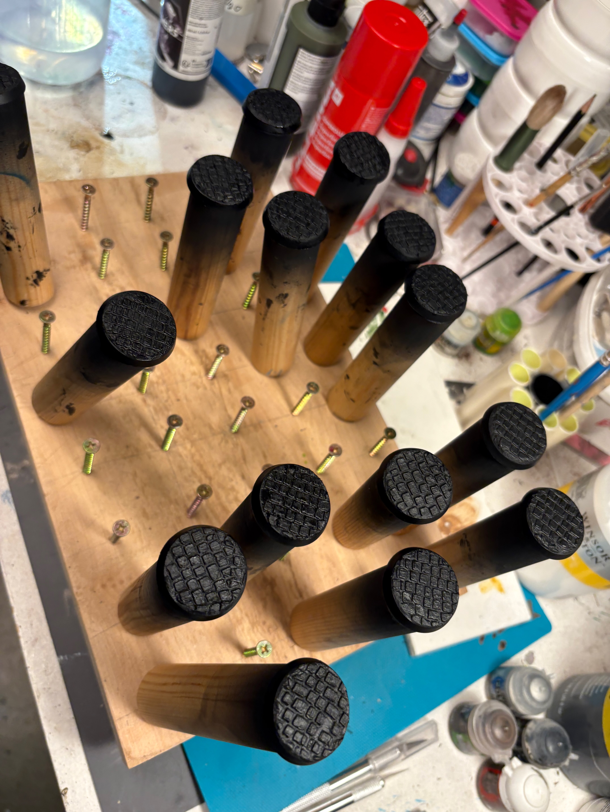
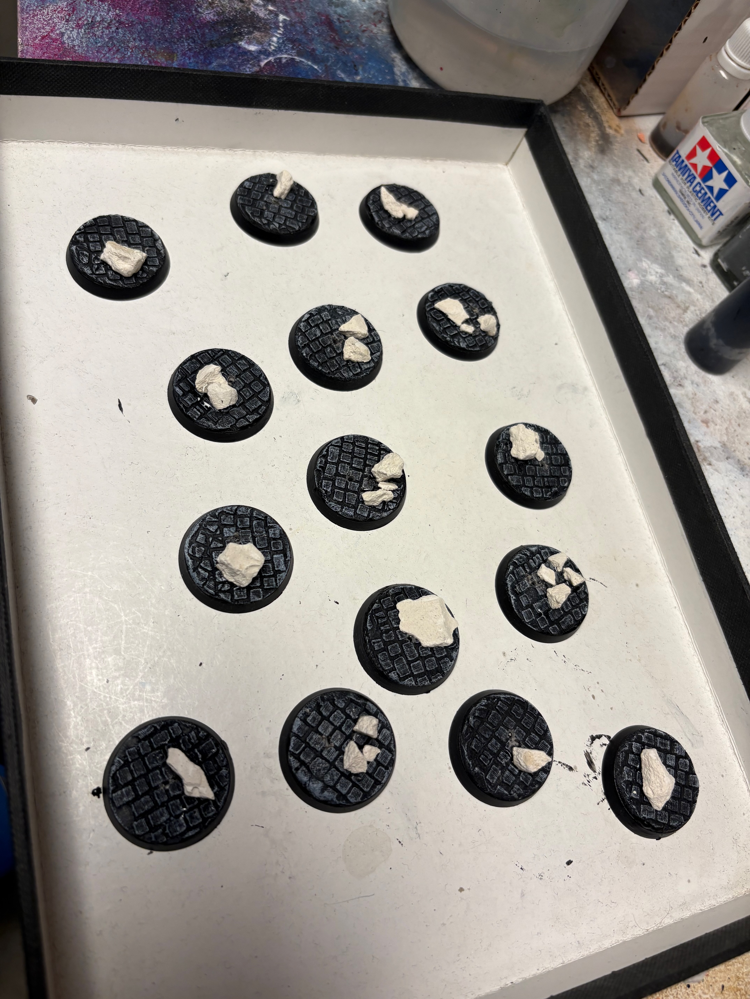

This guide documents the basing process used for my Tzeentch army.

The goal was a **simple, dark base** that lets the model stand out, but still includes some visual interest to draw the eye.

The theme is **ancient stone flooring**, inspired by the ruins of an old marble tower.

---

> [!NOTE]
> * Base
> * Air-dry clay + texture roller
> * Plaster (small broken pieces for white marble effect)
> * Superglue
> * Black primer (spray)
> * Grey — mid grey and a lighter highlight grey (both mixed from black + white)
> * Abaddon Black (for the base rim)

---

## Step-by-Step Process

### 1. Apply Texture

* Apply clay to the base.
* Use the **texture roller** to imprint the pattern.
* Remove any excess clay around the edges.

> [!TIP]
>
> Air-dry clay works best because it sticks to the base and holds texture well.

### 2. Let It Dry

* Allow the clay to **dry completely** before priming.
* This prevents cracking or paint separation later.

### 3. Add Marble Pieces

* Break small chunks of **plaster** by hand.
* Glue them to the base with **superglue** to represent broken marble fragments.

> [!TIP]
>
> Irregular, uneven pieces look more natural than uniform shapes. Press them flat so they sit flush with the stone floor.

### 4. Prime

* Spray the entire base with **black primer**.
* This creates strong shadows in the texture and ties clay and plaster together.

### 5. Dry Brush — Mid Grey

* Lightly dry brush **mid grey** (more black than white) over the raised texture.
* The plaster pieces will catch a lot of paint here — that's fine, they should read as light stone.

### 6. Final Highlight — Light Grey

* Apply a lighter dry brush of **light grey** (more white than black) to the highest points only.

> [!TIP]
>
> Use progressively lighter dry brushing to bring out the texture. Two passes is enough — don't overdo it or it loses the stone feel.

### 7. Base Rim

* Paint the base rim with **Abaddon Black** for a clean finish.

> [!TIP]
>
> Keep the base rim clean — it frames the model and improves presentation.

---

## Result

The finished base reads as dark, cracked stone flooring with pale marble rubble scattered across it. The black primer in the recesses does most of the work — the grey drybrushing just catches the top surfaces and sells the stone texture.

